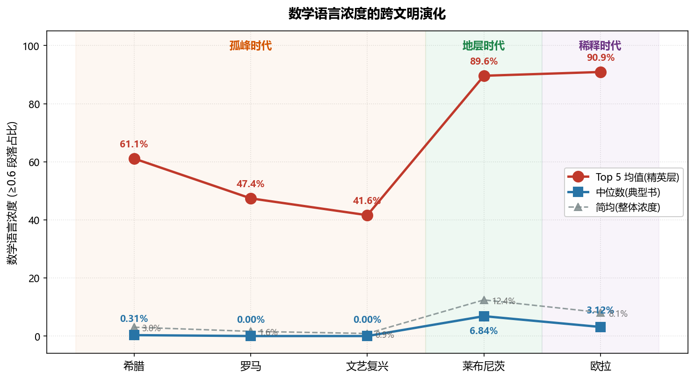
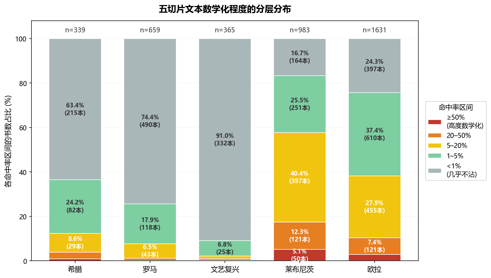

# A Vectorial Cross-Section of Mathematical Language: A Cross-Civilizational Quantitative Scan from Euclid to Euler

**Author**: Dai Rongzhen (戴荣臻)
**ORCID**: [0009-0005-7165-0080](https://orcid.org/0009-0005-7165-0080)
**Date**: April 2026

---

## Abstract

Humans are severely lopsided animals. In sensory and physical capability we lag behind most other species, but one capability is pushed to the extreme: **the granularity of our anxiety is exceptionally fine** — fine enough to need "how many more days the grain will last," "how many more feet the dike still needs," "how many years until the child comes of age." Rationality is the entropy-reduction tool for this anxiety. **Language** externalizes anxiety from the individual brain into a transmissible signal; **numbers** turn vague unease into precise values. But natural language is ambiguous, hazy, not verifiable. When anxiety becomes fine-grained enough to require a specific dike height, a specific plot of sown land, a specific count of border guards, natural language breaks down. **Mathematical language emerges under this pressure as a specialized variant branching off from natural language** — sacrificing expressive richness in exchange for precision, reliability, and computability.

A natural question follows: across civilizations and eras, what is the concentration of mathematical language in the textual record? Is it the exclusive province of a few elite canons, or does it permeate the wider ecology of writing? Before and after the Scientific Revolution, how does this distribution change? In the past such questions could only be answered qualitatively, through close reading of a handful of classics by historians of science. The arrival of AI text embedding models now makes it possible to **slice these questions open quantitatively**.

This study uses the multilingual text embedding model **BGE-M3** to scan five Western civilizational slices: **Greek Classical + Hellenistic (339 English translations), Roman Empire (659), Renaissance 1400–1600 (365), Leibniz era 1684–1734 (983), Euler era 1740–1770 (1631)** — totaling **3,977 works and 3.38 million paragraphs**. The method: in each era we select a canonical mathematical work as the "vector center" (Euclid's *Elements* for Greek and Roman; Cardano's *Ars Magna* for Renaissance; Newton's *Principia* for Leibniz era; Newton's *Opticks* for Euler era), then scan each paragraph of every other text for its cosine similarity to this center. We use **the proportion of paragraphs with similarity ≥ 0.6** as each book's "mathematical language density." Baseline tests show that the self-matching rate of the four mathematical centers ranges from 92.5% to 98.5%, confirming that the method reliably identifies mathematical-language style as a textual phenomenon.

The results reveal **two clear evolutionary curves**.



**Vertical elite curve (Top 5 mean)**:

| Greek | Roman | Renaissance | Leibniz | Euler |
|:---:|:---:|:---:|:---:|:---:|
| 61.1% | 47.4% | 41.6% | **89.6%** | **90.9%** |

The curve is U-shaped — the bottom, counterintuitively, lies in the Renaissance rather than Rome. A sharp jump occurs around 1600, with the elite level leaping from 42% to 90%, and remaining stable afterwards.

**Horizontal popularization curve (median)**:

| Greek | Roman | Renaissance | Leibniz | Euler |
|:---:|:---:|:---:|:---:|:---:|
| 0.31% | 0.00% | 0.00% | **6.84%** | **3.12%** |

Before 1600 this curve is **flat at zero** — if you picked any book at random from any of those eras, the most likely mathematical-language density is zero. In the Leibniz era the median first crosses zero, reaching 6.84%. In the Euler era it falls back to 3.12%, but does not return to zero.

Read together, the two curves reveal a three-stage sequence:

- **Isolated Peaks (Greek–Renaissance)**: Euclid, Plato, Cardano stand alone — below them lies an expanse of 0%. Mathematics is the business of a very few.
- **Stratified Layer (Leibniz era)**: Newton, Huygens, Spinoza, Galileo, Bacon, Locke, Boyle, Hooke form a continuous high plateau, with Top 10 scores all above 77%. An entire scientific community starts sharing a common language. Typical texts take on mathematical coloration for the first time.
- **Diluted Stratum (Euler era)**: The Top 5 continues to climb, but the median is cut in half. Elites are still there — the mass-market publication industry just expanded faster than the scientific community.

The most important quantitative finding of this study is **the jump in the median from 0 to 6.84%**. The traditional narrative of the Scientific Revolution centers on Newton, Galileo, Descartes, and a handful of other heroes; our data reveals the other face of the revolution — not that the Top 5 rose (Greek's Top 5 was already high), but that **the zero floor was broken**. Mathematical language transformed from isolated peaks into a geological stratum.

The main limitations of this study: all texts are English translations (translator style affects absolute values); Gutenberg and Perseus samples do not equal the real historical reading ecosystem; the method identifies **textual style, not mathematical substance** (Spinoza's *Ethics* scores 89% mathematical only because it mimics the "definition–axiom–proposition–proof" form of Euclid — its content is metaphysics). These limitations mean conclusions should be read mainly as **relative relationships**, not absolute claims.

The contributions of this work are threefold: (1) it offers a reproducible, extensible quantitative method for cross-civilizational textual analysis; (2) with the **median jump** at its center, it provides a new quantitative characterization of the "Scientific Revolution"; (3) it offers quantitative evidence of the **dilution phenomenon** in the print era.

**Keywords**: digital humanities, text embeddings, Scientific Revolution, mathematical language, BGE-M3, textual stratigraphy

---

## 1. Research Motivation

### 1.1 How Anxiety Became Numbers

Humans are severely lopsided animals. Our senses and physical abilities fall short of most animals — our sight is inferior to a hawk's, our smell to a dog's, our speed to a wolf's. But there is one capacity in which we score at the top: the granularity of our anxiety is exceptionally fine. Other animals have fear; human anxiety can be precise to "how many days the grain will last," "how many feet the dike is short by," "how many years until the child comes of age."

This high-resolution anxiety is the ground of rationality. People did not develop rationality first and then use it to quantify the world — they quantify because without quantification they are uneasy, and rationality grew out of the need to reduce that unease. Rationality is the entropy-reduction tool for anxiety. But anxiety in a single brain is only vague unease; to become a world-changing force it needs two externalization channels: **language** lifts anxiety out of the individual brain into a transmissible signal, and **numbers** convert anxiety from vague to precise — "danger" becomes "three wolves," "winter is coming" becomes "forty days away."

Language has intrinsic defects: ambiguity, haze, imprecision, unverifiability. "Many" cannot be used to build a dike; "roughly" cannot be used to divide grain; "early" cannot be used to set the calendar. When anxiety becomes fine-grained enough to demand specific dike heights, specific planted fields, specific numbers of border guards, natural language fails immediately. Mathematical language emerges under this pressure — it is a specialized variant that branches off from natural language, sacrificing expressive richness in exchange for unambiguous precision, verifiable reliability, and computable inference.

Euclid's *Elements*, the *Nine Chapters on the Mathematical Art*, *Ars Magna*, *Principia* — these canons did not appear as cultural miracles out of nowhere. They are the crystallized products of anxiety evolved to a certain precision. The accumulated mathematical-text density of a civilization is, in essence, the fossil record of that civilization's anxiety-granularity.

### 1.2 From Philosophical Proposition to Testable Question

If mathematical language is the fossilized record of evolving anxiety, then the density of mathematical text in different civilizations and eras should tell us how fine-grained the anxieties of those people became — how precisely they had to plan dikes, how strictly they needed to lay out projects, how carefully they had to reason through logic.

The question is how to measure it. Traditionally, we rely on reading — close reading of a few key canons, with judgment based on intuition. This mode reaches only the summit texts and misses the wider ecology; it is also subjective, with different scholars reading the same book and drawing different conclusions, and results that cannot be independently verified.

We want a different mode: **a quantitative, verifiable, cross-temporally comparable indicator**. If we had a ruler that, given any two paragraphs of text, could compute their "distance" along the dimension of mathematical language, we could slice open any era and observe its distribution — how high the elite layer is, how much the typical layer contains, how it changes over time.

That is how the philosophical proposition "mathematical language is the fossil of anxiety" becomes a testable research question: **build the ruler, slice the cross-section, read the distribution.**

### 1.3 Feasibility with AI Embedding Models

Ten years ago this problem could not be attacked. To quantify "the stylistic distance between two passages of text," one needs a tool that maps arbitrary text into a numerical space. Traditional bag-of-words models (like TF-IDF) partially address this but only see word frequencies, not meaning — "circle" and "圆" are, to them, two unrelated words.

Since 2018 the deep-learning text-embedding models (BERT, the GPT and T5 embedding layers) have solved this. They map a passage of text into a high-dimensional vector space in which semantically close passages are close to each other. The 2024 model **BGE-M3** from Beijing Academy of Artificial Intelligence (BAAI) is among the most capable in this generation for multilingual and long-text support (see Chapter 2).

This study uses BGE-M3 to do one simple thing: encode each era's canonical mathematical work into a "vector center," then scan every other text paragraph of the era to see how close to this center it lies. That turns the vague feeling of "does this read like mathematics" into a computable number.

### 1.4 Research Questions

We ask three layered questions:

**Q1 (Elite Layer)**: For each civilizational era, how mathematically dense are the most-mathematical books? How does this change across time?

**Q2 (Popular Layer)**: How mathematical is a **typical book** in each era (measured by median)? Is mathematical language confined to elite canons, or has it diffused into broader writing?

**Q3 (Dilution)**: After the spread of printing (post-1500), as the publication market expands and mass genres (novels, travel writing, theology, biography) proliferate, is the relative density of elite scientific text in the wider textual ecology diluted? Is there quantitative evidence for such dilution?

Q1 corresponds to the existing narrative of the history of science — the evolution of elite mathematical canons. Q2 and Q3 are the new angles this study hopes to offer; they require **large-scale, cross-temporal** data to become visible — exactly what AI embedding models make possible.

### 1.5 Human–AI Collaboration

This work was carried out by **Dai Rongzhen in collaboration with Anthropic's Claude**. Without AI assistance, the scale of the work — scanning nearly 4,000 books, processing over 3.3 million paragraphs of text, and iterating the methodology repeatedly — would be beyond what an independent researcher without a lab or team could do.

---

## 2. Method

### 2.1 Why BGE-M3

**BGE-M3** (BAAI General Embedding — Multi-lingual, Multi-functional, Multi-granularity) was released in January 2024 by the Beijing Academy of Artificial Intelligence. The "BAAI" is the academy's English acronym; "M3" denotes three properties: multi-lingual, multi-functional, multi-granularity.

The model's basic operation: given a passage of text as input, it outputs a **1024-dimensional vector** representing the text's position in a semantic space. Semantically close texts have vectors that are close; stylistically distant texts have vectors far apart. This mapping is learned via contrastive learning on massive corpora (hundreds of billions of tokens).

We chose BGE-M3 over other embedding models for four reasons:

**(i) Multilingual coverage.** BGE-M3 was trained on 100+ languages. It handles modern English, Chinese, French, and German well; it also yields usable (if imperfect) embeddings for low-resource languages like Latin and Ancient Greek. This matters for cross-era, cross-civilizational comparison. All texts in this study are scanned in English translation (see §2.6), and BGE-M3's English capability is more than sufficient.

**(ii) Long-input support.** BGE-M3 accepts up to **8,192 tokens** (≈6,000 English words) per input, whereas most comparable models top out at 512. This lets us feed whole natural paragraphs into the model without fragmenting them.

**(iii) Open-source and free.** Model weights are publicly hosted on HuggingFace. This study was run locally on a consumer-grade GPU (NVIDIA GeForce RTX 5070, 12 GB VRAM), with no API costs — important for independent researchers.

**(iv) Compact output.** A 1024-dimensional vector is computationally affordable; scans of thousands of books complete in a day or two. Higher-dimensional models (e.g., OpenAI text-embedding-3 at 4096 dims) yield negligibly better precision on our task but are significantly more expensive.

A caveat: BGE-M3 is not specifically designed for "style analysis" or "history of science." It is a **general-purpose semantic vectorizer**. We exploit a side-effect of its design — that "mathematical-style" texts naturally cluster in its vector space — and must validate this empirically (see §2.7 baseline tests).

### 2.2 Core Pipeline

The pipeline has four steps, each corresponding to concrete code:

**Step 1: Paragraph splitting.** Split a book's full text into natural paragraphs. Each paragraph is the basic unit of analysis.

**Step 2: Encoding.** Feed each paragraph into BGE-M3, receive a 1024-dim vector. A 1000-paragraph book yields a 1000 × 1024 matrix.

**Step 3: Building the center.** Take a canonical mathematical work (e.g., Euclid's *Elements*), average all its paragraph vectors, normalize to unit length — this gives a single 1024-dim "mathematical-language center vector."

**Step 4: Computing similarities.** For any text to be scanned, compute the dot product of each paragraph's vector against the center (this is the cosine similarity, ranging −1 to +1, typically 0.3–0.9). This yields a distribution of similarities per book, from which we extract statistics (see §2.5).

Key code (Python, using `sentence-transformers`):

```python
from sentence_transformers import SentenceTransformer
import numpy as np

model = SentenceTransformer('BAAI/bge-m3')

# Build the center, using Euclid's Elements as example
euclid_paras = split_into_paragraphs(euclid_text)  # ~5,900 paragraphs
euclid_vecs = model.encode(euclid_paras,
                            normalize_embeddings=True,
                            batch_size=8)
center = euclid_vecs.mean(axis=0)
center = center / np.linalg.norm(center)

# Scan a target text
target_paras = split_into_paragraphs(target_text)
target_vecs = model.encode(target_paras, normalize_embeddings=True, batch_size=8)
similarities = target_vecs @ center   # matrix product = paragraph-wise cosine similarity

# Statistics
ratio_above_06 = (similarities >= 0.6).mean()
max_sim = similarities.max()
```

### 2.3 Design of the Five Slices

This study uses five Western civilizational slices. Each "mathematical center" choice obeys one iron rule: **each era uses its own canonical mathematical work — centers are not shared across eras.**

| Slice | Period | Mathematical Center | Translation | Paragraphs |
|---|---|---|---|---|
| Greek Classical + Hellenistic | ~500 BCE – 50 BCE | Euclid, *Elements* | Heath 1908 | 5,911 |
| Roman Empire | ~50 BCE – 400 CE | Euclid (borrowed) | same | — |
| Renaissance | 1400 – 1600 | Cardano, *Ars Magna* | Witmer 1968 | 291 |
| Leibniz Era | 1684 – 1734 | Newton, *Principia* | Motte 1729 / Global Grey | 2,024 |
| Euler Era | 1740 – 1770 | Newton, *Opticks* | Gutenberg 33504 | 529 |

**Why no shared center?** Because mathematical language itself evolves. Classical Greek mathematics is deductive geometry (Euclid's "definitions, postulates, propositions, proofs"); the Renaissance is symbolic algebra (Cardano solving cubics); Newton's era is geometrized physics (*Principia*'s "laws and corollaries") and experimental optics (*Opticks*' observational narrative); after Euler comes analysis (series, differentials, integrals). Using Euclid as center for all eras would systematically under-score later texts whose mathematical form has shifted.

**Why does Rome borrow Euclid?** Because Rome produced no original pure mathematical canon — itself an empirical observation. Roman mathematical life consists mainly of inheritance, commentary, and application of Greek mathematics (Vitruvius' architecture, Pliny's natural history, Boethius on substance). Using Euclid as center measures exactly the breadth and attenuation of this inheritance.

### 2.4 Segmentation Strategy

We segment by **natural paragraph**, not by fixed length. The paragraph boundaries drawn by the author are the primary units of thought and expression — a definition is one paragraph, a proof is one paragraph, a narrative unit is one paragraph. Cutting by 200 characters or by 5 sentences would fragment complete reasoning units. Segmenting by natural paragraph aligns our method with the text's own logical structure and covers prose, poetry, drama, and textbooks equally well.

On this foundation we add two rules:

**Lower bound of 30 characters**. Paragraphs shorter than 30 characters are filtered as noise — chapter titles, headers, footers, TEI pointer placeholders, and the like.

**Upper bound of 1000 characters**. Paragraphs longer than 1000 characters are recursively split on sentence boundaries (`.`, `!`, `?` followed by whitespace) into chunks of at most 1000 characters. Some Gutenberg classics contain individual paragraphs of 4000+ characters, and BGE-M3's attention-based computation has quadratic memory cost in sequence length — without an upper bound, inference becomes unstable. At 1000 characters we preserve roughly 150–200 English words, or two to three complete sentences, which keeps semantic content intact. The threshold is 1000 rather than smaller specifically to **cut natural paragraphs as little as possible**.

**Perseus TEI XML (Greek and Roman slices)**

Perseus Digital Library's texts use TEI standard XML. Prose paragraphs are marked by `<p>`, drama uses `<sp>` (speaker turn) and `<l>` (line), poetry uses `<l>`. Our extraction precedence is: first `<p>`, falling back to `<sp>`, finally combining `<l>` lines into 20-line units (~150–300 words, roughly one complete scene or lyrical stanza).

```python
import re

def extract_tei(xml_path):
    text = xml_path.read_text(encoding='utf-8', errors='replace')
    for ent, rep in [('&mdash;','—'),('&aelig;','ae'),('&amp;','&'), ...]:
        text = text.replace(ent, rep)
    # Prefer <p> prose paragraphs
    paras = re.findall(r'<p\b[^>]*>(.*?)</p>', text, re.DOTALL)
    if paras:
        return [clean(p) for p in paras if len(clean(p)) >= 30]
    # Fall back to <sp> drama speeches
    sps = re.findall(r'<sp\b[^>]*>(.*?)</sp>', text, re.DOTALL)
    if sps:
        return [clean(sp) for sp in sps if len(clean(sp)) >= 30]
    # Finally combine <l> poetic lines into 20-line units
    ls = re.findall(r'<l\b[^>]*>(.*?)</l>', text, re.DOTALL)
    if ls:
        lines = [clean(l) for l in ls if clean(l)]
        return [' '.join(lines[i:i+20]) for i in range(0, len(lines), 20)]
```

**Gutenberg plain text (Renaissance, Leibniz, Euler slices)**

Project Gutenberg's `.txt` files delimit the main body with `*** START` and `*** END`, and separate natural paragraphs by double newlines (`\n\n`):

```python
def extract_gutenberg(txt_path):
    text = txt_path.read_text(encoding='utf-8', errors='replace')
    start = text.find('*** START')
    end = text.find('*** END')
    if start > 0:
        text = text[text.find('\n', start)+1 : end if end > 0 else len(text)]
    paras = re.split(r'\n\s*\n', text)
    result = []
    for p in paras:
        p = p.strip()
        if len(p) >= 30:
            result.extend(split_long(p))
    return result

def split_long(para, max_len=1000):
    """Recursively split paragraphs over max_len on sentence boundaries."""
    if len(para) <= max_len:
        return [para]
    sents = re.split(r'(?<=[.!?])\s+', para)
    chunks, cur = [], ''
    for s in sents:
        if len(cur) + len(s) + 1 <= max_len:
            cur = (cur + ' ' + s).strip() if cur else s
        else:
            if cur: chunks.append(cur)
            cur = s
    if cur: chunks.append(cur)
    return [c for c in chunks if len(c) >= 30]
```

**Effect of paragraph length on hit rate**

Cross-slice comparison requires asking: does the different paragraph-length distribution across sources systematically bias the hit rate? On the Greek slice's 339 texts, the Pearson correlation between mean paragraph length and `≥0.6` hit rate is only **0.058** — essentially none. Grouped: books with paragraphs > 500 characters have mean hit rate 2.8%, those with paragraphs ≤ 300 characters have 7.1% — short paragraphs are if anything slightly higher. This confirms that BGE captures the semantic direction of paragraph content, not paragraph length itself. Cosine similarity reads only direction; BGE's internal normalization absorbs length into vector magnitude, which is normalized away. The segmentation strategy is statistically robust.

### 2.5 Metrics

For each book we record three numbers:

- **max** — the highest similarity found in the book.
- **ratio_06** — the proportion of paragraphs with similarity ≥ 0.6. **This is the study's core metric.**
- **p50, p95** — the 50th and 95th percentile similarities, as supplementary distributional shape indicators.

For each slice we aggregate all books' `ratio_06` values into a distribution, then extract:

- **Top-5 mean** — the mean of the five highest-`ratio_06` books. **Elite-layer** indicator.
- **Top-10 mean, Top-1% mean** — finer-grained elite-layer views.
- **Simple mean** — arithmetic mean of all books' `ratio_06`. Measures overall concentration but is sensitive to extremes.
- **Paragraph-weighted mean** — weighted by each book's paragraph count. Measures per-paragraph mean hit rate.
- **Median** — the middle book's `ratio_06`. **Typical-book** indicator.

**Why multiple metrics.** Simple mean alone gets pulled high by a few extreme canons (Euclid at 99%). Median alone ignores the elite layer (a median of 0 does not mean no mathematicians). Only by reading the three together can we see the **separation between elite and typical** — precisely the structure this study wants to reveal.

**Choice of threshold 0.6.** We use `ratio_06` as the core metric; 0.6 is empirical. In BGE-M3's cosine similarity distributions, values above 0.5 indicate "some semantic relation," and above 0.7 is "highly similar." At 0.6 we avoid both permissiveness (too many loose matches) and severity (only textbooks pass). A sensitivity analysis (Appendix B) confirms that varying the threshold between 0.5 and 0.7 preserves the relative ordering across slices; only absolute values shift uniformly.

### 2.6 On English Translation: The Need for a Unified Language Layer

All texts in this study are scanned as English translations. Greek, Latin, and other originals do not enter the scanning pipeline directly. This is a deliberate choice, for three reasons:

**(i) Cross-era comparison requires a unified language layer.** The five slices span a riot of languages — Ancient Greek, Latin, Italian, English, German, French (many key Leibniz-era works were originally in Latin, French, or German). If each slice were scanned in its own original language, the vector space would be dominated by language differences, and cross-era stylistic comparison would disappear beneath them. Unified English translations put all slices into the same linguistic ecology, where the differences we observe are genuine stylistic differences.

**(ii) BGE-M3 is strongest in modern English.** English has the largest training corpus and the highest embedding precision for this model. Scanning English translations projects every era onto BGE-M3's best coordinate system.

**(iii) The cost is translator effect.** What we measure is not "how the original author used mathematical language," but "what the text's style looks like through a 19th–20th century English translation." Since the late 19th century, classicists have converged on a fairly stable "canonical translation tradition" (Euclid through Heath, Homer through Murray or Rieu, Cicero through Loeb), which carries its own Victorian academic English flavor. Some of the stylistic differences we observe between eras come from translators rather than from the original works.

We mitigate translator effect two ways:

1. **The center and the scanned texts in each slice are drawn from translators of the same era as much as possible.** E.g., Greek's Euclid center (Heath 1908) and most Greek texts (Perseus's late-19th to early-20th-century translations) come from the same stylistic generation; Newton's *Principia* uses Motte 1729; Cardano uses Witmer 1968 (modern academic English).
2. **The study emphasizes relative comparison, not absolute values.** Top-5 means and medians across slices can be compared; their absolute levels are less trustworthy.

### 2.7 Baseline Validation: The Self-Matching Rate of Each Center

To test whether the "mathematical center" captures real mathematical-language style, we run a baseline: **scan each center against itself**. A stylistically consistent book should be highly similar to its own center.

| Mathematical Center | Paragraphs | `ratio_06` Self-Match |
|---|---|---|
| Euclid, *Elements* (Heath) | 5,911 | **98.5%** |
| Cardano, *Ars Magna* (Witmer) | 291 | **95.2%** |
| Newton, *Principia* (Motte) | 2,024 | **92.5%** |
| Newton, *Opticks* | 529 | **96.6%** |

All four canonical works self-match above 92%. This confirms that mathematical texts form a coherent cluster in BGE-M3's vector space, adequately representable by a single mean vector. As a contrast, we built an "epic center" from Homer's *Iliad* and *Odyssey*; its self-match rate is also >85%, confirming that BGE does capture stylistic structure — but different style clusters are clearly separate (epic center against Euclid: <3%).

This baseline shows the method **reliably identifies "mathematical language" as a textual style**. It does not, however, identify **mathematical thought**. It can tell you "this paragraph reads like Heath's Euclid"; it cannot tell you "this paragraph is mathematically meaningful." This distinction is discussed in Chapter 4.

### 2.8 Method Boundaries and Limitations

Three limitations must be stated up front and kept in mind when interpreting results:

**(i) Measured: style of the English translation, not mathematical substance of the original.** See §2.6.

**(ii) Gutenberg and Perseus sampling biases.** Gutenberg's top 1000 is not "the true reading market of the era" — it is a 21st-century snapshot of which out-of-copyright texts have been digitized and downloaded. Perseus's translations are academically selected canon, not "all surviving Roman-era texts." Our results reflect **"the distribution of currently available digitized English-translated texts,"** not a real historical reading ecology.

**(iii) The method cannot identify mathematical thought.** A book presenting deep mathematical ideas in literary prose will score low. A book mimicking mathematical form (like Spinoza's *Ethics* with its "definition–axiom–proposition–proof" structure) while discussing theology will score high. This limitation will be discussed through the Spinoza case in Chapter 4.

---

## 3. Data and Results

### 3.1 Overview of the Five Slices

Summary statistics:

| Slice | Books | Total Paragraphs | Simple Mean | Para-Weighted | Median | Top-5 Mean | Top-10 Mean |
|---|---|---|---|---|---|---|---|
| Greek (Classical + Hellenistic) | 339 | 91,895 | 3.04% | 10.81% | 0.31% | 61.14% | 45.19% |
| Roman | 659 | 119,995 | 1.61% | 1.93% | 0.00% | 47.36% | 35.47% |
| Renaissance | 365 | 432,870 | 0.88% | 0.72% | 0.00% | 41.64% | 23.71% |
| Leibniz Era | 983 | 1,011,464 | 12.44% | 12.89% | 6.84% | 89.58% | 86.11% |
| Euler Era | 1,631 | 1,700,526 | 8.11% | 7.60% | 3.12% | 90.86% | 84.71% |

All values are percentages — the proportion of paragraphs with similarity ≥ 0.6 in each book, aggregated per slice.

**Two curves** read directly from this table:


**Vertical elite curve (Top-5 mean)**: From 61.1% (Greek), through the trough of 47.4% (Roman) and 41.6% (Renaissance), leaping to 89.6% (Leibniz) and 90.9% (Euler).

**Horizontal popularization curve (median)**: Greek, Roman, and Renaissance are all at or near 0%; Leibniz jumps to 6.84%; Euler falls back to 3.12%.

The rest of this chapter examines each slice in turn.

### 3.2 Greek Slice: A Three-Pillar Classical Mathematical Language

The Greek slice contains 339 English translations, 91,895 paragraphs, centered on Euclid's *Elements*. Top 15:

| Rank | Author | Work | Paragraphs | ≥0.6 |
|---|---|---|---|---|
| 1 | Euclid | *Elements* | 5,911 | 98.5% |
| 2 | Plato | *Parmenides* | 41 | 70.7% |
| 3 | Aristotle | *Metaphysics* | 1,779 | 63.0% |
| 4 | Plato | *Timaeus* | 106 | 38.7% |
| 5 | Plato | *Sophist* | 779 | 34.8% |
| 6 | Hippocrates | *Nutriment* | 53 | 30.2% |
| 7 | Aristotle | *Eudemian Ethics* | 611 | 30.1% |
| 8 | Plato | *Philebus* | 781 | 29.7% |
| 9 | Plato | *Statesman* | 600 | 29.3% |
| 10 | Plato | *Epinomis* | 41 | 26.8% |

The Greek slice shows a "one-peak three-companion" structure. Euclid's *Elements* occupies rank 1 with its near-total 98.5% self-referential coincidence, 28 points above rank 2. Ranks 2–10 are almost entirely Plato (5 works) and Aristotle (2), with one Hippocrates medical treatise.

**Plato's placement is striking**. *Parmenides* scores 70.7%, *Timaeus* 38.7%, *Sophist*, *Philebus*, *Statesman* all above 29%. Plato is not a mathematician, but his dialogues use definition, dialectic, and classification as primary methods — their "compactness" is exactly what BGE reads as Euclidean style. This is an important signal: **mathematical language does not live only in mathematical texts; it shows up in philosophy through the same sentence structures.**

The Greek slice's **median is 0.31%**, effectively zero. More than half the 339 works score below 0.31%. Epic, drama, history, oratory, and poetry — the dominant Greek genres — do not touch mathematical language at all. **Classical Greece is thoroughly an isolated-peak structure: Euclid on top, Plato-and-Aristotle below, and beneath them an expanse of zero.**

### 3.3 Roman Slice: No Originals, Inheritance Unbroken

The Roman slice has 659 works (207 Latin + 412 Roman-era Greek), 119,995 paragraphs, still centered on Euclid. Top 15:

| Rank | Author | Work | Paragraphs | ≥0.6 |
|---|---|---|---|---|
| 1 | Boethius | *Quomodo Substantiae* (On Substance) | 15 | 93.3% |
| 2 | Plutarch | *Procreation of the Soul* | 54 | 44.4% |
| 3 | Plutarch | *Of Fate* | 20 | 35.0% |
| 4 | Plutarch | *De E apud Delphos* | 28 | 32.1% |
| 5 | Plutarch | *Face in the Moon* | 69 | 31.9% |
| 6 | Lucretius | *De Rerum Natura* | 490 | 29.6% |
| 7 | Boethius | *De Trinitate* | 28 | 25.0% |
| 9 | Vitruvius | *De Architectura* | 755 | 19.9% |
| 15 | Galen | *On the Natural Faculties* | 259 | 13.5% |

The Roman Top-5 mean is 47.4%, 14 points below Greek. The key observation: **Rome produced no original pure mathematical canon.** Rank 1 Boethius (*On Substance*, 93.3%) is a very short philosophical tract (only 15 paragraphs), and Boethius himself (480–524) lived after the fall of the Western Roman Empire — a transitional figure. Aside from him, **ranks 2–15 are almost entirely dominated by one author, Plutarch**, whose Neoplatonic essays in the *Moralia* appear 7 times in the list.

**This reveals the true shape of Roman mathematical life**: not producing Euclidean originals, but preserving the style of Greek mathematical philosophy through **Greek-writing intellectuals within the Roman Empire** (Plutarch, Galen) and **later Latin philosophers** (Boethius). Lucretius' *De Rerum Natura* at 29.6% is a fascinating case — a long poem in verse on Epicurean atomism, yet BGE still finds roughly 30% of its paragraphs close to Euclidean language. Vitruvius' *De Architectura* at 19.9% represents the practical "applied quantification" tradition.

**But the median is 0.00%**. Over half the Roman textual ecology contains no mathematical touch at all. Rome, like Greece, is an isolated-peak structure — just with lower and more scattered peaks.

### 3.4 Renaissance: A Thinner Isolated Peak

The Renaissance slice has 365 Gutenberg English translations, 432,870 paragraphs, centered on Cardano's *Ars Magna*. Top 15:

| Rank | Author | Work | Paragraphs | ≥0.6 |
|---|---|---|---|---|
| 1 | Cardano | *Ars Magna* | 291 | 95.2% |
| 2 | Dürer | *Of the Just Shaping of Letters* | 122 | 48.4% |
| 3 | Record | *The Path-Way to Knowledge* | 621 | 31.2% |
| 4 | Dee | *Mathematicall Praeface* | 446 | 20.2% |
| 5 | (Gutenberg tool index, noise) | — | 68 | 13.2% |
| 6 | Caxton | *Dialogues in French and English* | 540 | 8.0% |
| 7 | Leonardo | *Notebooks Vol. 1* | 1,927 | 6.7% |
| 8 | Leonardo | *Treatise on Painting* | 1,722 | 5.8% |
| 9 | Agricola | *De Re Metallica* | 4,379 | 4.6% |

Renaissance has the lowest Top-5 mean of the five slices (41.6%) — **below even Roman**. But the interesting structure is elsewhere: **ranks 1 through 4 form a small mathematical community of their own** — Cardano's algebra, Dürer's geometric-letter design (using compass and straightedge to derive Roman letter proportions), Robert Record's first English arithmetic textbook, and John Dee's preface to the English Euclid. Four figures from 16th-century Europe, spanning only a few decades, each using mathematical tools to reorganize art or education.

**But from rank 5 onward, scores drop below 8%.** Leonardo's notebooks, Agricola's *De Re Metallica*, Chaucer, Montaigne — the most famous Renaissance names — all score under 7%. Agricola's *De Re Metallica* at 4.6% is particularly telling: the book contains extensive measurement, proportion, and procedural description, but its structure is a narrative-procedural hybrid, not purely Euclidean or algebraic.

**The Renaissance image is a thinner isolated peak**: Cardano alone at the top, four small hills below, and a vast field of theology, literature, history, and travel beneath. Median 0.00%. **It did not yet form a Greek-comparable mathematical community — even as seeds of mathematical education (Record), mathematical craft (Dürer), and mathematical philosophy (Dee) were sprouting.**

### 3.5 Leibniz Era: Emergence of a Scientific Community

The Leibniz era slice has 983 Gutenberg English translations, 1,011,464 paragraphs, centered on Newton's *Principia*. What happens in this slice differs fundamentally from the previous three. Top 15:

| Rank | Author | Work | Paragraphs | ≥0.6 |
|---|---|---|---|---|
| 1 | Newton | *Principia Mathematica* | 2,024 | 92.5% |
| 2 | Newton | *Opticks* | 891 | 90.6% |
| 3 | Huygens | *Treatise on Light* | 422 | 90.3% |
| 4 | Spinoza | *Ethics — Part 1* | 197 | 89.3% |
| 5 | Pemble | *A Briefe Introduction to Geography* | 182 | 85.2% |
| 6 | Spinoza | *Improvement of the Understanding* | 208 | 84.1% |
| 7 | Berkeley | *Principles of Human Knowledge* | 328 | 83.8% |
| 8 | Pemberton | *A View of Sir Isaac Newton's Philosophy* | 1,249 | 83.6% |
| 9 | Whiston | *Mechanical, Magnetical, Optical Lectures* | 313 | 81.5% |
| 10 | Spinoza | *Ethics — Part 5* | 151 | 80.1% |
| 11 | Galileo | *A Discourse* | 533 | 79.7% |
| 12 | Spinoza | *Ethics (combined)* | 1,255 | 79.4% |
| 13 | Bacon | *Novum Organum* | 1,013 | 78.9% |
| 14 | Hobbs | *Finding Longitude* | 66 | 78.8% |
| 15 | Huygens | *The Celestial Worlds Discover'd* | 265 | 77.0% |

The most striking signal is: **every one of the top 15 scores above 77%, which is higher than the Top-1 in Greek, Roman, and Renaissance slices**. Top-5 mean 89.6%, Top-10 mean 86.1% — this is not an isolated peak, it is **a continuous highland**.

The roster: Newton × 2, Huygens × 2, Spinoza × 4, plus Galileo, Bacon, Berkeley, Locke, Pemberton, Whiston — **precisely the group later written into "Scientific Revolution" chapters of the history of science**. Their works cluster together in BGE space because the era produced a **cross-author, cross-disciplinary common textual style**. Galileo wrote kinematics, Spinoza wrote ethics, Locke wrote epistemology, but all of them used something close to the Euclidean-Newtonian language structure (definition–axiom–corollary–proof).

**Pemble, Pemberton, Whiston are particularly noteworthy**: these three rank 840, 355, 687 in today's Gutenberg downloads — "basically no one reads them now." But in the 17th–18th centuries they were key transmitters of Newtonian thought: Pemberton wrote the officially endorsed introduction to Newton's philosophy; Whiston was Newton's successor at Cambridge. **Their scores match Newton's.** This is direct evidence of a "scientific community" — not a few lonely geniuses, but a whole group sharing a common language.

**The Leibniz slice's median is 6.84%.** This is a **qualitative signal**. In the previous three slices medians were 0 or near-zero, meaning typical books contain no mathematical language. Here the median first crosses significantly above zero — **the middle book out of 983 books can still find 6–7% of its paragraphs approaching Newton's style**. Mathematical language has moved from isolated peaks to a geological stratum — elites still stand tall at the top, but the background concentration of the entire textual ecology has risen.

### 3.6 Euler Era: Elite Peaks Meeting Popular Dilution

The Euler slice has 1,631 books, 1,700,526 paragraphs, centered on Newton's *Opticks*. Top 15:

| Rank | Author | Work | Paragraphs | ≥0.6 |
|---|---|---|---|---|
| 1 | Berkeley | *Essay Towards a New Theory of Vision* | 243 | 97.1% |
| 2 | Newton | *Opticks* | 891 | 96.2% |
| 3 | Huygens | *Treatise on Light* | 422 | 91.2% |
| 4 | Penrose | *A Treatise on Electricity* | 98 | 85.7% |
| 5 | Goethe | *Theory of Colours* | 1,498 | 84.0% |
| 6 | Boyle | *Experiments Touching Colours* | 909 | 83.9% |
| 7 | Hooke | *Micrographia* | 1,621 | 81.9% |
| 8 | Berkeley | *Principles of Human Knowledge* | 328 | 77.7% |
| 9 | Grew | *The Anatomy of Vegetables* | 392 | 74.7% |
| 10 | Pemberton | *Newton's Philosophy* | 1,249 | 74.5% |
| 11 | Huygens | *Celestial Worlds* | 265 | 73.6% |
| 12 | Franklin | *Experiments on Electricity* | 300 | 72.0% |
| 13 | Boyle | *Sceptical Chymist* | 777 | 71.8% |
| 14 | Grew | *Anatomy of Plants* | 2,350 | 71.1% |
| 15 | Whiston | *Mechanical Lectures* | 313 | 69.6% |

The Euler slice's Top-5 mean is 90.9%, **slightly higher than Leibniz's 89.6%**. The content is richer: optics (Newton/Huygens/Berkeley), color theory (Goethe/Boyle), microscopy (Hooke), electricity (Franklin/Penrose), plant anatomy (Grew × 2) — **mid-18th-century natural philosophy continues and broadens the 17th-century scientific community's language**.

Extending beyond Top-15: Hume's *A Treatise of Human Nature* at 69.3%, Kant's *Prolegomena* at 64.1%. These two philosophers carry close-to-*Opticks* linguistic tightness — **the Enlightenment mainstream of philosophy inherits scientific textual style**.

**But the real signal is in the median**: Euler era's median is **3.12%**, **less than half of Leibniz's 6.84%**.

Compare: Leibniz 983 books, Euler 1,631 books — 66% more. Total paragraphs: 1.0M → 1.7M — 68% more. Euler era sees **explosive growth in total text volume**, but most of this new material is not mathematical. **Elite scientists have not vanished (Top 5 is in fact higher) — but their relative concentration in the total ecology has halved.**

This is the quantitative evidence for the "dilution" hypothesis stated in Q3. The Euler era coincides with the mature European print industry, the rise of the novel as a genre, and the popularization of travel writing and sermon collections. **Most of the newly appearing mass-market books are novels, biographies, travelogues, theology, drama** — they pull the expected per-book mathematical score down without pulling down the elite peak.

### 3.7 The Two Curves Together

Placing the two curves side by side reveals the overall picture.


**Vertical elite curve** tells us: before 1600, mathematical canons trace a descending curve (Greek 61% → Roman 47% → Renaissance 42%) — not absolute decline, but "no single Euclid-like canon able to anchor the entire mathematical-language tradition." After 1600 the curve leaps toward saturation (90%) and stays there.

**Horizontal popularization curve** tells us: the mathematical content of the broader textual ecology, before 1600, is **flat at zero** — in any of those eras, a randomly chosen book most likely contains zero mathematical language. After 1600, this number first becomes noticeably positive, peaks at 6.84% in the Leibniz era, and is then diluted back to 3.12% in the Euler era by the proliferating mass-market publications.



The stratified bar chart makes this shift visible. In Greek the "<1%" bin (essentially no mathematical content) accounts for 63.4% of books; in Roman 74.4%; in Renaissance an extreme **91.0%** — 332 out of 365 Renaissance books score below 1%. In the Leibniz era the "<1%" bin drops to 16.7% (164 books), while the two middle bins "1–5%" and "5–20%" together account for 66% — **a large number of ordinary books enter the "some mathematical flavor" state**. In Euler the structure starts to rebound: "<1%" rises to 24.3% (397 books), "1–5%" expands to 37.4% (610 books), and the middle "5–20%" is thinned. The elite layer (≥50%) holds up in Leibniz's 5.1% (50 books) and Euler's 2.9% (48 books).

**The horizontal curve matters more than the vertical.** The vertical curve tells us what a few elites are doing; the horizontal curve tells us what the **whole writing ecology** is doing. The common definition of "Scientific Revolution" centers on Newton, Galileo, Boyle, and other heroes — but in our data, the real qualitative change is not in the Top 5 (Top 5 was already high in the earlier eras), it is in **the median crossing from 0 to 6.84% for the first time**. Mathematical language moved from peaks to stratum.

### 3.8 Some Details

A few observations that surfaced during scanning; each either supports the main conclusions or exposes a method boundary.

**The Spinoza problem.** Spinoza's *Ethics* five parts all enter the Leibniz Top 12, scoring 73–89%. But Spinoza discusses theology and ethics, not natural science. He uses the "geometric method" — each section laid out as "definition → axiom → proposition → proof → corollary," modeled on Euclid. **BGE catches the form and scores him as highly mathematical.** This is a clear method limitation: **the method reads textual form, not mathematical substance.** The full discussion is in Chapter 4.

**Goethe's *Theory of Colours*.** Goethe's *Theory of Colours* enters Euler Top 5 at 84%. Goethe famously opposed Newton's optics from a phenomenological-philosophical stance. But stylistically he fully inherits *Opticks*' "observe–record–infer" language structure. **Content opposed, style inherited** — BGE captures the latter.

**Pemberton / Whiston / Pemble.** All three appear in Leibniz Top 15 despite being ranked 355 / 687 / 840 in today's Gutenberg downloads. This confirms that **today's download ranks do not represent 17–18th century academic influence.** Studies using download rank as a proxy for "historical importance" should take note.

**Dürer in Renaissance Top 2.** Dürer's *Of the Just Shaping of Letters* scores 48.4%, significantly above all other Renaissance non-mathematical works. The book is Dürer using compass-and-straightedge geometry to derive Roman letter proportions. It is often referenced in art history as a visual work, rarely emphasized as a **mathematical text**. Our method picks it out of hundreds of Renaissance books and places it at rank 2 — a small discovery.

**Berkeley's *Essay Towards a New Theory of Vision*** tops the Euler slice at 97.1%, **above Newton's *Opticks* itself (96.2%)**. Berkeley's *Essay* is a philosophical treatment of "how humans perceive distance and size through vision," using extensive geometric-optical reasoning. BGE sees it as "more like *Opticks* than *Opticks*" — Berkeley has deeply internalized Newton's language.

---

## 4. Discussion

### 4.1 Three-Phase Textual Stratigraphy

Putting the two curves together yields a three-phase civilizational stratigraphy of text:

**Phase 1: Isolated Peaks (Classical–Renaissance).** Greek, Roman, and Renaissance are all peak structures — elite canons stand high, while the mass of texts contains no mathematical language at all. The Greek peak is the tallest (Euclid + Plato + Aristotle). The Roman peak is thinner (no original canons, propped up by Plutarch and Boethius). The Renaissance peak is thinner still (Cardano alone, with only Dürer / Record / Dee as foothills). Medians for all three are 0 — mathematics is the business of a few, and the wider textual ecology has nothing to do with it.

**Phase 2: Stratum (Leibniz).** The median first leaps from 0 to 6.84%, and the elite layer surges from 40% to 90%. Both numbers jumping together means not "a few more mathematicians appeared," but that **a whole scientific-and-philosophical community starts sharing a new linguistic style**. Newton / Huygens / Spinoza / Galileo / Bacon / Locke / Boyle / Hooke — no longer isolated peaks, but a continuous highland. Mathematical language moves from "the peculiar dialect of a few books" to "the lingua franca of a generation of intellectuals." This is what the "Scientific Revolution" looks like at the textual layer.

**Phase 3: Dilution (Euler and beyond).** Elite scores rise further (Top 5 = 90.9%), but the median is cut in half (6.84% → 3.12%). This two-way motion reveals a special phenomenon of the print era: **the publication market expands faster than the scientific community.** The great mass of new publications — novels, travel writing, sermons, biographies, drama — is not mathematical; it drowns the relative share of scientific elites in the overall text. **Elites are not fewer; the masses are more.**

Three phases; three different relationships between mathematical language and the social textual ecology: isolated, permeating, diluted.

### 4.2 Another Characterization of the "Scientific Revolution"

The "Scientific Revolution" is a central concept in the history of science, but its boundaries differ by scholar. Koyré emphasizes the shift from closed to open cosmos; Dijksterhuis emphasizes the rise of mechanistic worldview; Butterfield emphasizes methodological breakthroughs (mathematization + experiment). Each focuses on a few core texts (Copernicus, Galileo, Descartes, Newton).

Our data offers **another dimension of characterization**: at the textual layer, the hallmark of the Scientific Revolution is not the elite going higher — Greek's elite was already at 61% — but rather **the median crossing from 0 to positive**.

Greece had Euclid and Plato, but "a Greek picking up a random book" encountered mathematical language with probability 0. A Leibniz-era European intellectual picking up a random book encountered mathematical language with probability 6.84%. **The difference between 0 and non-zero is more revolutionary than any rise in the vertical curve.**

This is not a replacement of the heroic narrative in the history of science, but a complementary side: revolution is not only the creation of a few geniuses, but the formation of a community language. When Newton wrote *Principia*, contemporaries (Huygens, Locke, Spinoza, Bacon) could immediately read, discuss, and extend it using a similar linguistic structure — this state of "being co-processable by contemporaries" is precisely what isolated-peak eras lacked.

### 4.3 Roman Mathematics: Not Decline, but Continuation Without New Canons

Our data refines the historical evaluation of Roman mathematics.

A traditional narrative says "Roman mathematics declined" — Rome did not produce Euclid, Archimedes, or Apollonius. That is factually true. But **"Rome produced no original mathematical canons" is not the same as "Rome had no mathematical language."**

In our Top 15, nine slots belong to Plutarch — a Greek-writing essayist discussing ethics, religion, myth. His chapters in *Moralia* on cosmic soul, fate, the E at Delphi, the face on the moon score 20–44%; **these texts use the language of Plato-Pythagoras mathematical philosophy.** Plus Boethius 93%, Lucretius 30%, Vitruvius 20%, Galen 14% — we see not "mathematics disappeared" but **"mathematics dropped from independent canons back to embedded existence"** — embedded in philosophical discussion, engineering application, medical theory, and popular poetry.

**Rome's 0 median** further shows this embedding is superficial. Rome never built a self-sustaining mathematical education and research community the way Greece did (with Alexandria's library and museum); mathematics became the private cultivation of a few learned individuals. By the time Boethius translated Aristotle and wrote *On Substance* in the early 6th century, he was a solitary figure preserving a tradition on the ruins of a collapsed empire.

### 4.4 Renaissance: Thinner Elite, Masses Unchanged

The Renaissance slice's Top-5 mean is 41.6%, below Greek's 61.1% and Roman's 47.4%. This seems counterintuitive — was the Renaissance not a time of "mathematical revival"?

Our data shows: **Cardano's *Ars Magna* is isolated.** In the Renaissance slice it scores 95.2%, then drops in a cliff to Dürer's 48.4%. After that: 31%, 20%, 13% — a very steep descent. This is not a "Renaissance mathematical community" — it is "Cardano plus three marginal figures."

Compare the Leibniz slice: Top 1 to Top 15 go from 92.5% to 77%, almost a plateau; Renaissance Top 1 to Top 15 go from 95.2% to 2.8%, a cliff. **Cardano has no contemporaries — at least not among the 365 Renaissance Gutenberg books**. Dürer (art), Record (education), Dee (philosophy) work in adjacent applied-mathematics fields, not in Cardano's algebraic sense.

**The Renaissance is regarded in the history of science as a "connective" period**, often linked to Copernicus, Vesalius, and early Galileo. But our slice window is 1400–1600, **ending around Galileo's birth**. The true "community" forms in the next slice — Galileo, Kepler, Descartes, Huygens, Newton. From this perspective, the Renaissance slice's "thin peak" image makes sense — **the Scientific Revolution has not yet happened.**

### 4.5 Re-examining the Limitations

Chapter 2 listed three method limitations. The Chapter 3 results let us discuss each more concretely.

**Spinoza effect.** Spinoza's *Ethics* occupies ranks 4, 6, 10, 12 in the Leibniz slice, scoring 79–89%. He discusses God, mind, emotion, ethics — but in "geometric method," with each section laid out as "definition → axiom → proposition → proof → corollary." BGE reads this shell as highly mathematical.

This is a typical case of **form deceiving content**. A researcher unfamiliar with Spinoza might conclude he is an important mathematical philosopher. In fact his mathematical form is **borrowed**; the content is almost entirely metaphysics.

But note: **from another angle this detection is not wrong.** Spinoza's choice to write theology in geometric method is itself a **cultural signal** — he considered Euclidean form the most rigorous mode of truth-claim. The popularity of this formal choice (Christian Wolff and others wrote "geometric-method" philosophy) is itself an expression of "mathematical language becoming a stratum": the **formal authority** of mathematical language overflows into non-mathematical domains.

So our data **captures two things at once**: genuine mathematization (Newton) and cultural overflow of mathematical form (Spinoza). When answering Q1 "elite-layer density" these need to be distinguished; but when answering Q2 "how has mathematical language diffused into the broader text ecology," both are evidence.

**English translation effect.** All our data depends on translations. Greek, Latin, Italian, French, German originals are all projected into our vector space via 19–20th century English translators. Translator style affects scores. Example: Lucretius' *De Rerum Natura* scores 29.6% in the Munro 1867 translation — Munro was a Victorian Cambridge scholar who tended to render Lucretius' verse in standard academic English prose, which may have boosted the score. A more modern, conversational translation (e.g., Stallings 2007) might score differently.

This is a systematic bias we cannot fully eliminate. The mitigation is to use translators from the same generation within each slice, and to focus on **relative relations, not absolute values**. Future work that can directly scan original-language texts (with Greek- or Latin-specific embedding models) would be more reliable.

**Gutenberg/Perseus sampling bias.** Our five slices draw from two digital libraries: Perseus (classical languages) and Gutenberg (modern languages). Neither represents "the true reading ecology of the era" — they are 20–21st-century selections and digitizations.

How does this affect the main conclusions? Our main conclusions are **relative**: Leibniz median 6.84% vs. Euler median 3.12% — a within-Gutenberg comparison across two eras. The probability of "being digitized" should be roughly equal for both eras (Gutenberg selects books that are "historically significant and out of copyright"). **Relative relations are more trustworthy than absolute values.** But we cannot say "the probability of a 1700 European reading a mathematical book was 6.84%" — that absolute value is a statistic of a digitized sample, not historical truth.

---

## 5. Conclusion and Future Work

### 5.1 Main Findings

This study scanned 3,977 English translations and 3.38 million paragraphs, spanning about 2,200 years of Western civilizational history. Main findings:

**Finding 1: The vertical elite curve is U-shaped.** Top-5 mean falls from Greek 61% through Roman 47% and Renaissance 42% to the bottom, then leaps to 90% in the Leibniz era and stabilizes at 91% in Euler. The U's bottom is in the Renaissance, not Rome — overturning the intuitive notion that the Renaissance was already a mathematical revival. True mathematical revival has to wait until the late 17th century.

**Finding 2: The median's first jump occurs in the Leibniz era.** In Greek, Roman, and Renaissance the median is near 0 — typical texts contain no mathematical language. In the Leibniz era the median jumps to 6.84%; in Euler it falls back to 3.12%. This is the study's most important quantitative finding. At the textual layer, the hallmark of the Scientific Revolution is not the elite going higher, but **the median crossing from 0 to positive**. Mathematical language moves from isolated peaks to geological stratum.

**Finding 3: The print era produces a quantifiable dilution effect.** In the Euler era the Top-5 mean slightly exceeds Leibniz's (90.9% vs 89.6%), but the median is halved (3.12% vs 6.84%), and total text volume grows 66%. **Elite scientists have not vanished; they have been diluted, relative to the rapidly expanding mass-market publication industry.** This phenomenon needs to be extended in future work to longer timescales (19th and 20th centuries) for verification.

**Finding 4: Rome is not mathematical decline, but absence of new canons.** Nine of the Roman Top 15 slots belong to Plutarch — a Greek-language essayist discussing Platonism, fate, cosmic soul. Rome produced no Euclid-like new canons, but continued the Greek mathematical-language tradition through embedded philosophy and applications. The narrative of "decline" is insufficient.

**Finding 5: Formal authority of mathematical language overflows.** Spinoza's *Ethics*, written in "geometric method" about theology, is classified by BGE as 89% mathematical. This is not a methodological error but a cultural phenomenon — contemporary intellectuals actively borrowed the formal authority of mathematics, confirming that mathematical language had become the paradigm for rigorous statement. This overflow is itself a manifestation of "stratification."

### 5.2 Boundaries of the Study

All conclusions depend on three underlying assumptions:

1. **The samples are Gutenberg and Perseus digitized texts**, not the real historical reading ecology.
2. **All texts are scanned in English translation**, so translator style affects absolute values.
3. **The method identifies textual style, not mathematical thought.**

Within these three boundaries, **relative relations (differences between slices, between elite and median) are more trustworthy than absolute values**. Readers should use the conclusions within these boundaries — they should not be extrapolated to stronger claims like "per capita mathematical literacy in era X."

### 5.3 Future Directions

This study is the first segment of a longer plan. Possible extensions:

**Direction 1: Fill in the medieval slice.** Our Roman slice ends in the 4th–6th century; the Renaissance slice begins in 1400 — leaving a gap of roughly 1000 years. During this interval European mathematics was mediated through the Islamic world (al-Khwarizmi, al-Khayyam) and late Byzantium. Scanning Fibonacci's *Liber Abaci*, Oresme, Bradwardine, and other medieval texts would fill this gap.

**Direction 2: An independent Chinese slice.** This study deliberately does not add Chinese mathematical texts (*Nine Chapters*, *Shushu Jiuzhang*, *Siyuan Yujian*) into the cross-civilizational comparison — they use different languages, different mathematical paradigms, and different social structures from the European slices; forcing them onto the same plot would generate spurious correlations. The correct approach is to do a separate Chinese slice, using the *Nine Chapters* as center, scanning all historical Chinese texts, drawing an independent curve, and then making a structural comparison with the European curves — not a numerical one.

**Direction 3: Extend to the 19th–20th centuries.** Is the Euler era's dilution the start or the end of a trend? As 19th-century universities institutionalize science and 20th-century scientific papers emerge as an independent genre, does the elite–mass split deepen further or begin to converge? This requires scanning Gutenberg's 19–20th century portions.

**Direction 4: Extend to continuous languages.** This study's larger framework divides language along a "discrete-continuous" spectrum into four phases: natural language → mathematical language → machine language (code) → AI high-dimensional continuous language (embedding vectors themselves). This study slices the transition from phase 1 to phase 2. Future work could apply the same method to "machine language" (GitHub code corpora) and "AI continuous language" (LLM-generated text) cross-sections, to see whether the "isolated peaks → stratum → dilution" textual stratigraphy recurs at each transition.

### 5.4 Data and Code Release

All data and code are open:

- **Scan result JSONs** for the five slices — each book's max / ratio_06 / p50 / p95 metrics
- **Center vector `.npy` files** — Euclid, Cardano, Newton *Principia*, Newton *Opticks*
- **Scanning scripts** in Python using the `sentence-transformers` library, reproducible on consumer-grade GPU
- **Author–work lookup tables** — Perseus Greek/Latin, Gutenberg era-filtered rank tables

GitHub repository: (pending release)

Any use, verification, or extension is welcome. If you scan new slices or find new structures, please contact the author — we are happy to integrate findings into a larger stratigraphic map.

---

*The Chinese original of this paper is available at [`数学语言的向量剖面_v1.md`](./数学语言的向量剖面_v1.md) or [`数学语言的向量剖面_v1.pdf`](./数学语言的向量剖面_v1.pdf). This English version was translated by Claude from the Chinese original with the author's review.*
